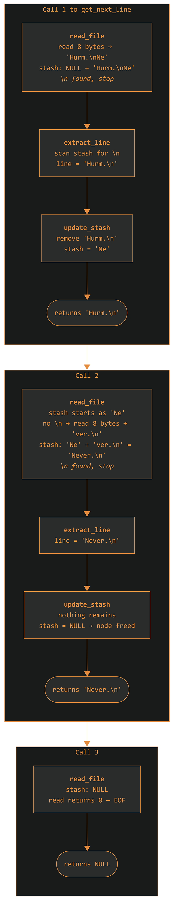
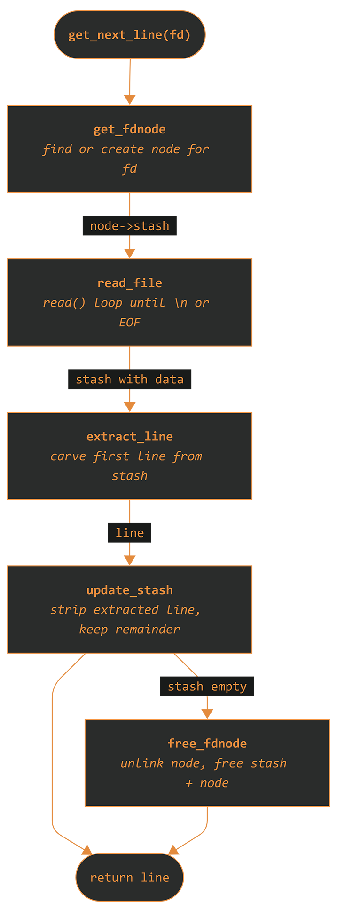

<p align="center">
  
</p>
	
<div align="center">

[](https://42.fr/en/homepage/)
[](https://github.com/baderelg/Get_next_line) \
 \
[](https://github.com/baderelg/Get_next_line)

</div>

> [!NOTE]
> <details>
> <summary><strong>What is 42?</strong></summary>
>   
> > [42 School](https://42.fr/en/homepage/) is a coding school focused on peer to peer learning and being project driven.\
> > We are given a project, a set of rules and clear objectives, and then it's up to us to figure out how to achieve the goal.\
> > It pushes you to learn how to learn. It may be intense and sometimes frustrating but the sense of accomplishment makes everything worth it.\
> > Short term comfort is sacrificed for long term growth and versatility.
> </details>
> 
> <details>
> <summary><strong>What is GNL?</strong></summary>
> 
> > `get_next_line` (GNL) is one of the classic early projects at 42. The goal is simple:\
> > Create a function that, when called, reads a line from a text file (or any other file descriptor)
> > 
> > The Bonus part adds a bit of complexity, like managing multiple file descriptors simultaneously with a single static variable\
> > It's a solid exercise in memory management, file I/O and string manipulation under strict coding constraints
> > 
> > <b>📏 Norminette</b></br>
> > The Norm is a set of coding rules used in all 42 projects: 
> > ```markdown
> > - No more than 25 lines per function
> > - No more than 5 function definitions per file
> > - No ternary operators
> > - Variable declarations must be at the top of the function
> > - No for loops
> > - Function and file names must follow snake_case
> > - and many other rules...
> > ```
> </details>
> 
> To make the journey entertaining, I chose to approach the project through the eyes and voice of a fictional character.
> 
> <details>
> <summary><strong>Why?</strong></summary>
>
> > First and foremost, to avoid boredom. And while this started as just a weird habit, I quickly found it effective at keeping me engaged in the projects.\
> > Embodying a character while tackling any exercise forges stronger connections with the logic and makes it truly engaging.\
> Sometimes, it even gives me new perspectives. Who would have thunk?
> >
> </details>
> <details>
> <summary><strong>Why Rorschach?</strong></summary>
> 
> > Get Next Line is a byte by byte interrogation of data.\
> > It demands an obsessive level of attention and focus to isolate the lines from partial read, unpredictable buffer sizes and EOF.\
> > Rorschach, with his attention to detail and his absolute refusal to compromise embodies the spirit GNL requires.\
> > So who better to stare into the abyss and extract exactly one line, no more, no less?
> </details>

---

<p align="center">
  
</p>

> **Rorschach’s journal.** \
> The city bleeds data. Memory is a crime scene. \
> They call it "Get Next Line". A simple name for a dirty job.\
> My job is to read between the lines, examine every byte.
> One line at a time. No assumptions.\
> Just the truth dragged out of the file descriptor, screaming.

#  Assignment: Interrogation of a file descriptor

You think reading from a file is simple? That data spills neatly into memory like poetry?

It doesn’t.

It’s jagged, incomplete. Ends mid-sentence. Or worse, lies. `get_next_line` doesn’t just *read* a file. It **interrogates** it.

This project demands a function:
```c
char *get_next_line(int fd);
```
And its purpose is simple. Read a line from a given file descriptor (`fd`).

<b><ins>What constitutes a "line"?</ins></b>

A sequence of characters that concludes with a newline character <b>\n</b>, if one even exists.</br>
The function must return this extracted line.</br>
If the end of the file `EOF` is reached and no more characters can be read, or if any error occurs during the process, it must return `NULL`.

> [!IMPORTANT]
> > Bonus part.
> > This city always has another layer of grime.
> 
> The bonus demands two specific perversions of your function:
> - Handle multiple file descriptors at once, keeping each one's testimony straight even when switching between them with consecutive calls.
> - Using the discipline of only one single static variable.

##  Restrictions: Rules of the city

### ➢ The Norm
> The city has rules. Here is the cage they built.

  ➖  Function length: 25 lines. Line width: 80 columns. \
  ➖  4 function parameters at maximum. 5 variables per function.\
  ➖  No global variables, no static outside permitted scope.\
  ➖  One declaration per line and it must be at the top.\
  ➖  No `for` loops, `do...while`, `switch`, `case`, `goto`. These are chains. I work best within them.\
  ➖  Everything must compile. No warnings. No leaks. No exceptions. Never compromise.

### ➢ Authorized tools
  
| Only use  | Forbidden |
| ------------- | ------------- |
| `read`  | No `lseek()` |
| `malloc`, `free`  | No global variables |
| Utils in `get_next_line_utils.c`  | No libft   |

### ➢ Buffer zone
`BUFFER_SIZE` dictates how much we grab at once. Could be 1, could be 9999.
```bash
-D BUFFER_SIZE
```

> [!CAUTION]
> **Undefined Behavior**
>   - Reading binary files.
>   - Modifying file content between calls.

##  Submission: Required evidence

* [`get_next_line.c`](./get_next_line.c)
  the heart of the operation. It handles all the logic to read the fd line by line.
* [`get_next_line_utils.c`](./get_next_line_utils.c)
  a utility belt that holds custom implementations from Libft[^1] or new helper functions.\
   (This project recodes and adapts the functions `strjoin`, `strlen`, `substr` and `strchr` but feel free to use your own)
* [`get_next_line.h`](./get_next_line.h)
  the manifest. It declares everything. The function prototypes. The `BUFFER_SIZE` macro. The `t_fdnode` structure.


#  Modus Operandi

> **Rorschach’s journal.** \
> Truth hides. Buried in bytes, wrapped in logic.\
> Reading is just the beginning. Understanding takes method.\
> They call it logic. They call it discipline.\
> I however call it surveillance.

A file descriptor is a raw feed.\
When I `read()` from it, I get a chunk of data dictated by `BUFFER_SIZE`.\
Sometimes I jump right to the end of the story `EOF`. Sometimes I get a chunk.\
That chunk might contain less than a full line, multiple lines or exactly one line with a bit of luck.\
But I don't deal in luck.

##  Foundations: 

> What's one more body amongst foundations?

### ➢ Static Variable: Memory and the unseen remnants

Memory doesn’t vanish. It lingers. Static variables? They're the minds that never forget.

A `static` variable inside a function retains its value between function calls.\
This is how we remember data across multiple calls of `get_next_line()` without needing forbidden global variables.
```c
static t_fdnode *fd_list = NULL;
```
This is the memory ledger. It keeps track of file descriptors and what's been read but not yet returned.\
Every `fd` gets its own `stash` storing unread fragments, waiting for the next call.

### ➢ 🔗 Linked list

A chain of nodes. Each one holds data and a pointer to the next. It grows when needed, shrinks when it's done. No wasted space.\
Perfect for tracking an unknown number of file descriptors.
  
  ```c
  typedef struct s_fdnode {
	int fd;
	char *stash;
	struct s_fdnode *next;
} t_fdnode;
  ```
- `fd` is the unique file descriptor this node is tracking
- `stash` is the dynamically allocated string holding any characters read from this fd, and that has not yet been formed into a returned line. \
  It may also be called the remainder.
- `next` is a link to the next node, or to `NULL` if it's the last one.

This ensures that each `fd` has its own separate stash.

<p align="center">

</p>

> [!TIP]
> The `static t_fdnode *fd_list` always points to the first node in this chain.
> When a call to `get_next_line()` happens, a helper function (`get_fdnode()`) is called to:
>  - either retrieve the matching `fd`'s node
>  - or create a new one if no match was found

### ➢ The Stash

The `char *stash` inside each node is where the real dirty work happens for each file descriptor.\
When `read_file()` <sup>[(get_next_line.c)](./get_next_line.c)</sup> calls `read()`, the data obtained from the file descriptor is appended to this stash, saved until we know what it means.
- If `read()` pulls half a line? It sits there waiting for more.
- If `read()` pulls three lines, the first is processed and the other two (or even any partial fourth) remain in the stash.

The `stash` is a persistent buffer tied to a specific `fd` via its node.\
It's constantly being manipulated.
- `ftg_strjoin` is used to append newly read data. This custom version is designed to allocate new memory for the combined string and free the old stash that it was given as an argument, to avoid any leaks.
- `extract_line` <sup>[(get_next_line.c)](./get_next_line.c)</sup> uses `ftg_substr` and reads from the stash to find the end of the current line (be it \n or EOF) and allocates memory for it to be returned.
- `update_stash` <sup>[(get_next_line.c)](./get_next_line.c)</sup> then takes the original `stash`, removes the line that was just extracted and returns a **newly allocated string** containing only what remains. The old stash is freed, and if there is no remainder then the functions returns `NULL` signifying that the stash is now empty.

> Read.\
> Append.\
> Extract.\
> Update.\
> Good job. No Data is lost.\
> Roll on snare drum. Curtains.

<p align="center">

</p>

##  The Interrogation chamber: Functions at work

> **Rorschach’s journal.** \
> I have mapped the antechambers.\
> The static memories, the linked chains of evidence, the festering stash where raw data waits.\
> Now, the door to the interrogation chamber itself.

Five functions. Each one has a role, a method, a reason to exist.\
Libft[^2] helpers handle the string work. These handle the investigation.

<p align="center">

</p>

`get_fdnode` is the navigator that walks the chain looking for a node matching the given `fd`. If it finds one, it returns it. If not, it builds a new one and shoves it at the front of the list.\
If `malloc` refuses, there's nothing to return.

`read_file` is where the interrogation happens. It sits in a loop calling `read()` and appending to the stash until either a `\n` shows up or EOF finally puts an end to it.\
If `read()` fails, everything gets freed. No evidence left behind.

`extract_line` is the analyst. It scans the stash for the first `\n`, carves everything up to AND including it into a new string via `ftg_substr` and hands it back.\
The stash stays untouched. That's not its crime scene to clean.

`update_stash` is the cleaner. It throws away what was just extracted and keeps whatever is left. If there's nothing left, it frees the stash and returns `NULL`.\
The old stash dies here no matter what. No loose ends.

`free_fdnode` is the undertaker. When an `fd` has nothing left to confess, this function pulls its node out of the linked list and buries it. Stash first, node second.\
That order matters: once the node is gone, so is the pointer to the stash.

> Every malloc is a deal. A promise.\
> The stash, the lines we return, the t_fdnode structs, the temporary buffers in read_file(), all of them are debts.\
> Leave one unpaid, and the program bleeds memory.\
> Leaks aren't bugs. They're negligence.\
> And in this city, negligence is a cardinal sin.

#  Lurking dangers: Edge cases & Points of failure

> So you think you've tamed it? Dragged a few lines from the digital sewer?\
> The city always has more to trip you, to watch you bleed.
> Complacency is a death sentence.

The path of `get_next_line` is littered with traps.

##  Memory, the lingering stain

Like roaches, memory leaks multiply in the dark corners of sloppy code.</br>

### ➢ **The `stash`**
- This buffer of leftovers is prime real estate for leaks.
- Each time it's grown or re-assigned, the old skin must be shed with `free`.
- When a file descriptor's tale is told (EOF & stash empty) or an error makes its testimony worthless, its entire node (including the stash) must be purged.

### ➢ **The returned `line`**
- Each `get_next_line` call returns a freshly allocated line.
- The caller, the one who asked for the line bears the burden of freeing it.

### ➢ **Node structures (`t_fdnode`)**
- While juggling multiple file descriptors, each node itself is malloced.
- These too must be hunted down and freed by the Undertaker function when their purpose ends.
- Every `malloc` is a promise and `free` must keep it. Break too many and the program drowns in its own undeclared waste.  

##  BUFFER_SIZE, the double-edged blade

> BUFFER_SIZE will destroy us all

### ➢ **Invalid sizes**
- A `BUFFER_SIZE` less than or equal to 0 is an invitation to chaos.
- This `get_next_line` checks for it. Any sane implementation should treat it as an error
- <ins>BONUS</ins> - To treat negative `BUFFER_SIZE` and still return NULL, a redundant `if (BUFFER_SIZE < 0)` is shoved inside read_file to please the compiler<details>
	<summary>Why?</summary>
		════════════════════════════</br>
   		The compiler, when shackled by the error mandate (-Wall -Wextra -Werror), has its own peculiar sensitivities.
		</br>Dare to define BUFFER_SIZE as some negative obscenity, and even if the main function already treats it, the compiler might still choke on how BUFFER_SIZE is referenced within read_file before execution logic can sidestep the issue
		</br>So, a token check gets shoved in.
		</br>Yes, it’s a ghost at runtime, a redundant echo of a decision already made. Still...
		</br>A necessary, if irksome, nod to the machine's inflexible gaze.
	</details>

### ➢ **`BUFFER_SIZE` = 1**
- Testing patience.
- Every single byte is a separate read call, a separate append.
- The logic for handling partial lines, finding \n and managing the stash will be stretched to its limit.

### ➢ **MASSIVE `BUFFER_SIZE` (for example 10,000,000)**
- Fewer `read` calls, true. But the `stash` might suddenly hold entire novels.
- Can the string functions handle these colossal strings efficiently?
- Can `malloc` grant such a large temporary buffer for `read()` without choking on itself?
- If the implementation handles memory properly and the string operations don't choke, it will survive.
- A **default value** must be defined, for what happens if none is provided by the caller?

It's not about right or wrong. It's about what is.

##  File descriptors, the corrupted informants

> Tonight, a file descriptor died in New York.

The `fd` is merely a number.\
It might point to the truth, to a lie or even straight to an empty void.

### ➢ **Invalid fds**
- Negative numbers, absurdly high numbers or descriptors that simply don't exist or have been closed.
- `read()` will likely return -1 in those cases.
- The function must catch this, clean up any allocated memory and return `NULL`.   

### ➢ **Standard Input** `STDIN_FILENO`
- The function must work as expected when reading from the standard input.
- This is just another `fd` (usually 0) so it must be tested.

### ➢ **Non-regular files**
- The use of `read()` must be agnostic to the source type, as long as it's a stream of bytes. 
- <ins>BONUS</ins> - While often tested with text files, an fd can point to other things like pipes.[^3]<details>
	<summary>How to check?</summary>
		════════════════════════════</br>
   		Declare an array int pipefd[2].
		</br>Use the system call pipe() on pipefd to create a new pipe object within the OS kernel.
   		</br>Write into pipefd[1].
		</br>Don't forget to close pipefd[1]. (very important! otherwise gnl might block indefinitely while waiting for more data, as read() won't return 0 for EOF)
		</br>Read from the read end of the pipe (pipefd[0]) using get_next_line.
	</details>

##  Files content variations, a treacherous terrain

Never assume the data stream is clean.\
It's often a pure reflection of this city: messy and unpredictable.

### ➢ **Empty files**
- `read()` will immediately return 0 (EOF) so `get_next_line` must do it gracefully.

### ➢ **No Newlines**
- The entire file is one long gasping line?
- `get_next_line` must read it all then return it.
- Subsequent calls return `NULL`. The abyss looks back.

### ➢ **Only Newlines**
- A file of `\n\n\n`.
- Each call should return a string containing just `\n`.

### ➢ **Newline placement**
- The returned line should include the terminating `\n` character, except when the end of the file is reached and the file does not end with a `\n` character.
- The line extraction and `stash` update logic must honor this with precision.

### ➢ **Varying line lengths**
- Lines can be short or monstrously long.
- The `stash` must grow to accommodate them.    

##  System failures, when the city crumbles

> Evil doesn't die. It just changes faces.

### ➢ **Read() failure**
- If `read()` returns -1, it's an error.
- The `read_file` function must detect this and free its own temporary buffer and version of the `stash` it was modifying.
- Then it signals the error to `get_next_line` (by returning `NULL`) so that the `t_fdnode` associated with the problematic fd is removed.

### ➢ **Malloc() failure**
- The city's resources are finite.
- `malloc` can return null if memory is exhausted. 
- Every call to `malloc` must be checked. (for new nodes for the stash, for the returned line, for temporary buffers)
- On failure, any memory already allocated for the current operation must be released, the relevant `fd` cleaned up and finally, `NULL` returned. 


---

## The End is Nigh

> **Rorschach’s journal.** \
> "And the file will look up and shout "ONE LAST LINE!"… and I’ll look down and whisper "No.”"

This file is afraid of me. I have seen its true face.

**I watch. I slice. I return.**

Never compromise. Not even in the face of Segfault.

<p align="center">
  
</p>
<hr>
<p align="center">
<sub><i>GET_NEXT_LINE badge © @Cadets for Cadets — used under MIT License.</i></sub>
<br>
<sub><a href="https://github.com/ayogun/42-project-badges/blob/main/LICENSE">See full license here</a></sub>
</p>

[^1]: Libft is the first project of the common core at 42. [My version explained by Ted Lasso is right here!](https://github.com/baderelg/Libft/) The project prohibits linking a compiled libft.a but allows recoding its functions.
[^2]: Functions `strlen` `strchr` `substr` and `strjoin` are taken from the Libft Project (with a slight modification for GNL)
[^3]: [Check over here for information on the pipe() system call](https://www.geeksforgeeks.org/pipe-system-call/)
